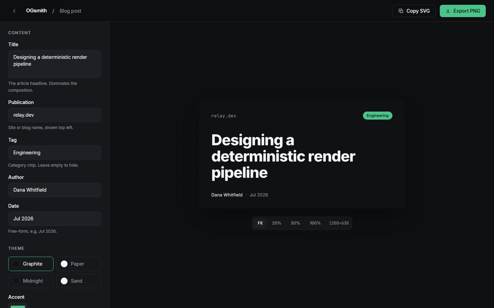
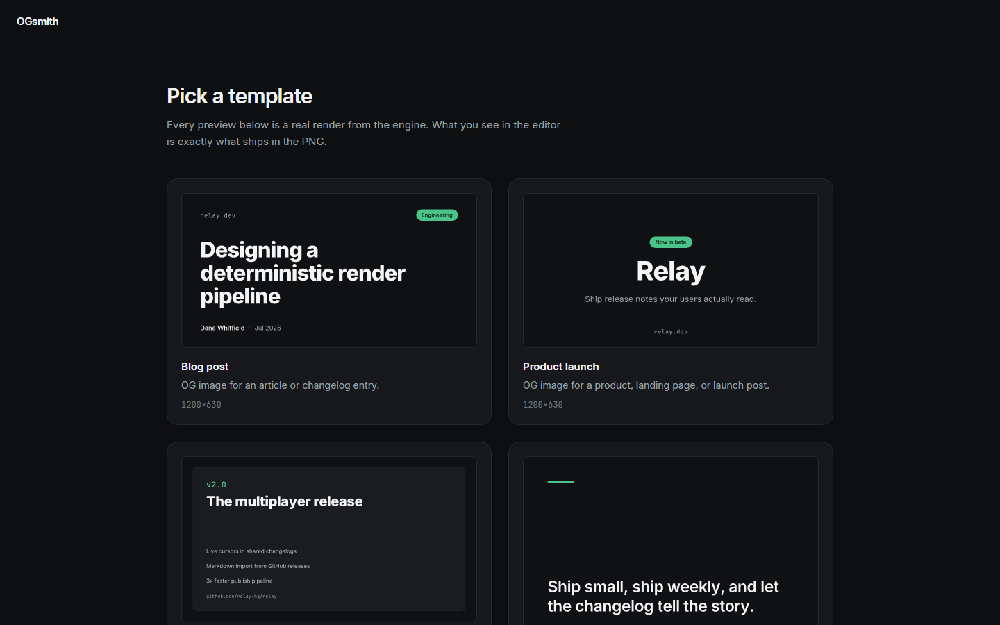

# OGsmith

Open-source studio and rendering engine for pixel-perfect Open Graph images,
social cards, and release banners. What you see in the editor is exactly
what ships in the PNG: preview and export are the same artifact by
construction.



## Two deliverables, one repo

- **[`ogsmith`](packages/core)** (npm): a typed, deterministic SVG to PNG
  rendering engine. Same props, same bytes, in Node, in CI, and in the
  browser.
- **[OGsmith Studio](apps/studio)**: a client-only visual editor. Pick a
  template, edit with live preview, export in one click. No account, no
  server, no telemetry.

## How parity works

There is exactly one rendering path. Templates are pure functions that
satori lays out into an SVG string; the studio preview displays that exact
SVG, and the PNG export rasterizes the same string with resvg. No parallel
HTML preview exists, so preview and export cannot drift. CI enforces it:
the wasm (browser) raster path must produce byte-identical PNGs to the
native (Node) path, verified by sha256 on every push.

```
props ── template fn ── satori + bundled fonts ──▶ SVG  ──▶ preview (as-is)
                                                    └─────▶ resvg ──▶ PNG
```

Determinism rules: bundled OFL fonts only, no network at render time, no
time or randomness inside templates, pinned raster options, hash-verified
output.



## Templates and themes

Four built-in templates (blog post, product launch, release banner, quote
card) times four themes (graphite, paper, midnight, sand). Every pair is
snapshot-tested and WCAG AA contrast-checked automatically. Custom
templates plug in through a zod-schema registry; the studio generates its
editor form from the schema, so new templates require zero studio changes.

## Run it locally

```bash
npm install
npm run dev        # studio at http://localhost:3109
npm run verify     # lint + typecheck + tests + build
```

## Documentation

- [Product brief](docs/PRODUCT.md)
- [V1 scope](docs/SCOPE.md)
- [Technical architecture](docs/ARCHITECTURE.md)
- [Architecture decisions](docs/DECISIONS.md)
- [Studio interface specification](docs/UI_SPEC.md)
- [Executable backlog](docs/BACKLOG.md)
- [Test strategy](docs/TESTING.md)
- [Engine API](packages/core/README.md)

## License

MIT © [Fabio Rosa](https://github.com/fabiorosa)
